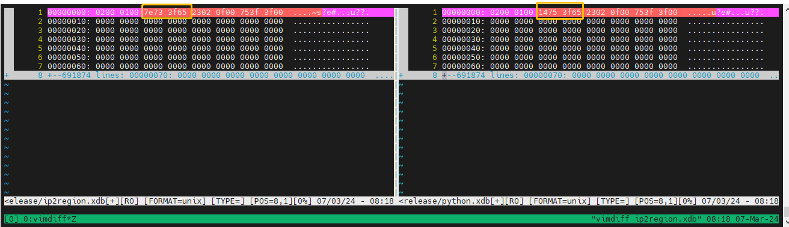

# ip2region xdb rust 生成实现

## 使用方法
* 当前目录下maker子目录下执行 `cargo build --release` 编译生成工具  
* 目标生成在targe/release 目录下 maker  
* 使用方法: 
```
 Usage: maker --in-file <IN_FILE> --out-file <OUT_FILE>
 Options:
  -i, --in-file <IN_FILE>
  -o, --out-file <OUT_FILE>
  -h, --help                 Print help
  -V, --version              Print version
```

例如，通过默认的 data/ip.merge.txt 原数据，在target目录下生成一个 ip2region.xdb 二进制文件： 

```
kevin@ubuntu ~/i/m/r/m/t/release (master)> ./maker  -i ../../../../../data/ip.merge.txt  -o  ip2region.xdb
load 683844 lines
try to write the segment index ptr ...
write done, dataBlocks: 13827, IndexBlock: 683844, indexPtr: (983587, 11070069)
Done, elpsed: 0m7s

```

## 数据查询/bench 测试
* 通过将以上步骤生成的二进制文件和python 生成工具生成的二进制文件进行二进制比对，除时间戳位置不同，其它均相同。


* 已经完成开发的 [binding](../../binding/) 都有查询和 bench 测试程序以及使用文档，你可以使用你熟悉的语言的 searcher 进行查询测试或者bench测试，来确认数据的正确性和完整性。

